<div align="center">

# 🎛️ SceneDeck Android

### Your OBS setup. Pocket-sized control. Main-character energy. ✨

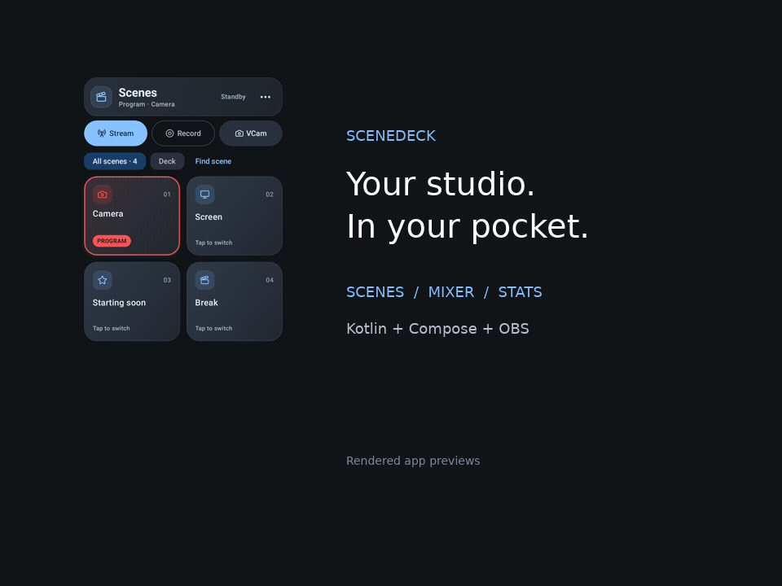

[](https://github.com/worxbend/scenedeck-android/actions/workflows/ci.yml)
[](https://github.com/worxbend/scenedeck-android/actions/workflows/codeql.yml)


**Tap scenes. Ride the faders. Keep your stream in check.**

</div>

SceneDeck turns your Android phone or tablet into an OBS Studio remote. OBS runs on
your desktop; the scenes, mixer and stream controls are right in your hand.
Inspired by the Linux [SceneDeck](https://github.com/worxbend/scenedeck) workflow,
rebuilt with Kotlin and Jetpack Compose.

## 🪄 The studio glow-up

- **Scenes:** a clean card grid, numbered tiles, scene search and a curated Deck filter.
- **Stream control:** blue **Stream** → breathing red **Stop** when live. Green stream
  timers and yellow recording timers in the header keep output state easy to read.
- **VCam:** a direct virtual-camera action alongside Stream and Record.
- **Mixer:** vertical faders, live audio meters, direct mute, channel locks and audio settings.
- **Stats:** FPS, bitrate, frame drops, CPU and render time, with gauges and rolling trends.
- **Studio mode:** preview scenes and transition controls, ready for your next cue.
- **Your vibe:** dark/light themes, multiple palettes, dynamic color and reduced-motion options.
- **Extras:** scene curation, dependency graph, Doctor checks, saved connections, QR pairing,
  an Android widget and optional background connection.

Curation lives on your device. SceneDeck preserves your OBS scene collection.

## 📸 A little studio tour

| Scene deck | Streaming | Recording |
|:--:|:--:|:--:|
| 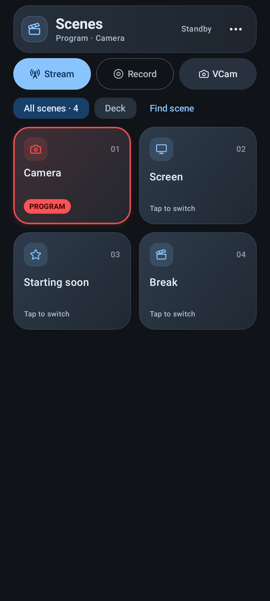 | 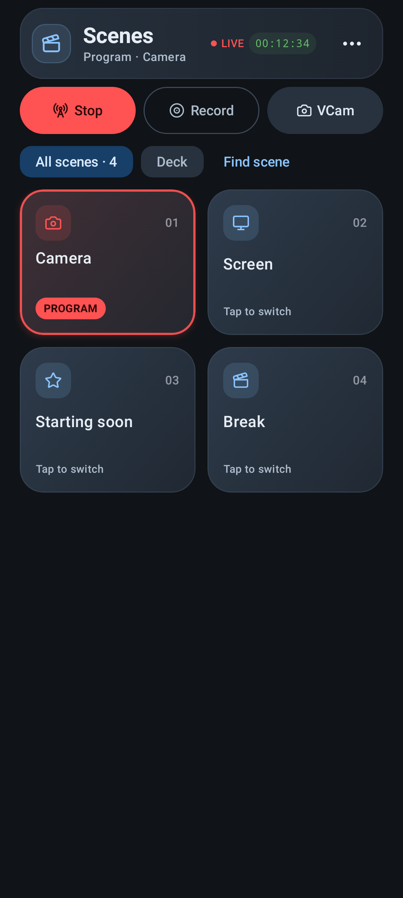 |  |

| Studio preview & switching | Audio mixer | Stream health |
|:--:|:--:|:--:|
| 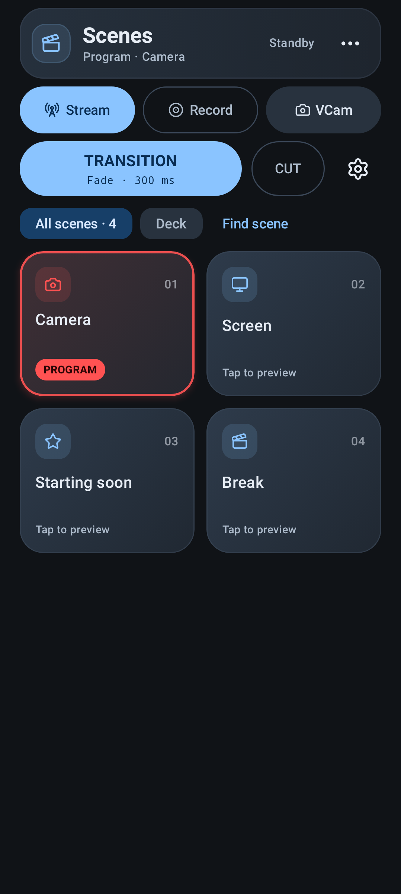 | 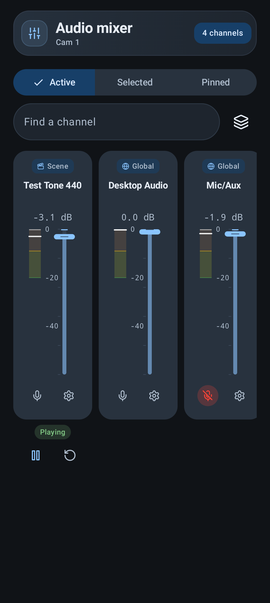 | 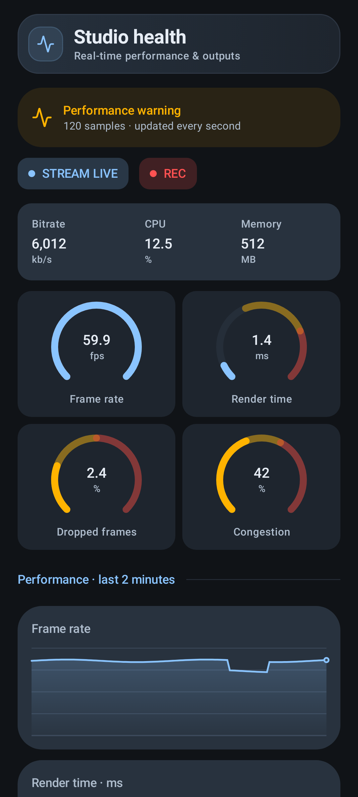 |

| Appearance | Connections | Light theme |
|:--:|:--:|:--:|
| 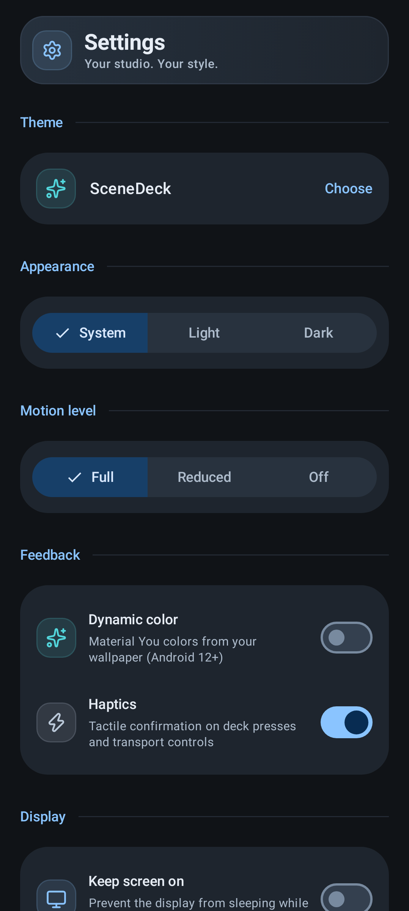 | 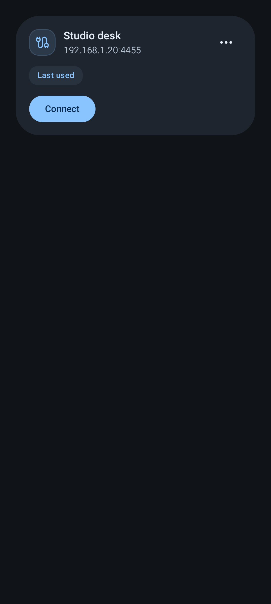 | 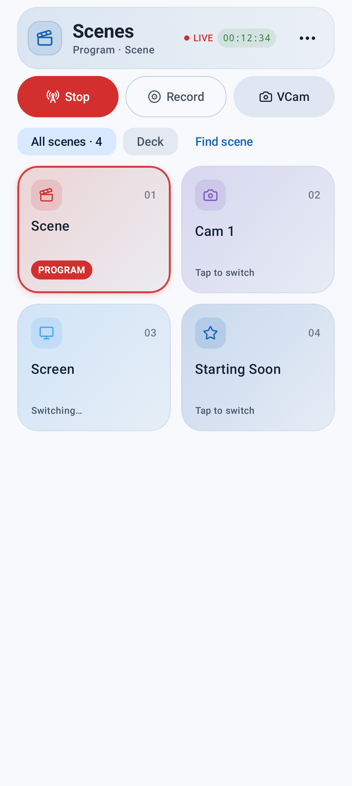 |

| Scene switched | Stream + record | Light recording |
|:--:|:--:|:--:|
| 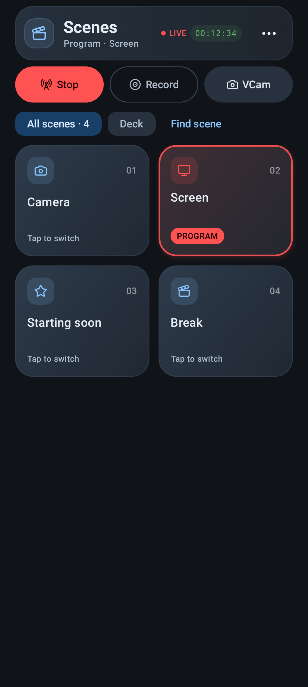 | 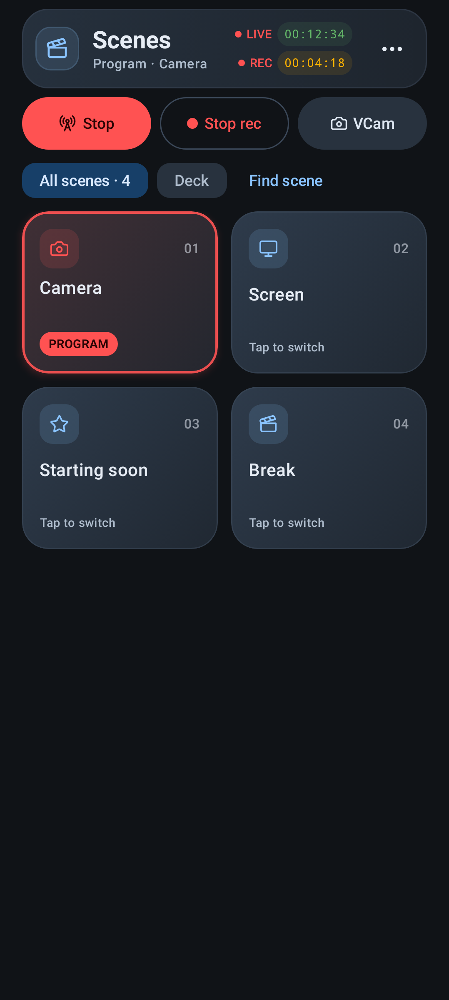 | 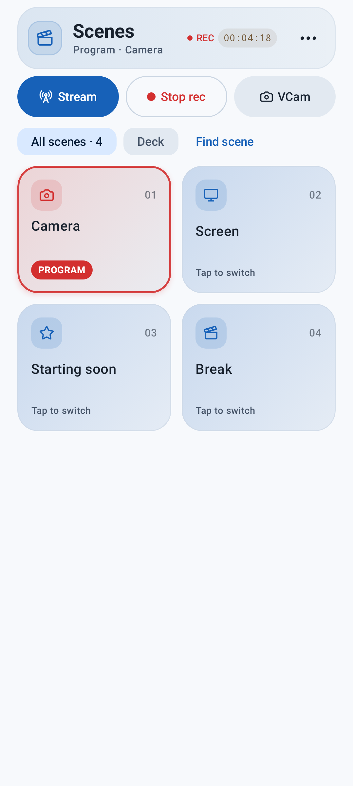 |

*These are rendered application UI previews with representative OBS data. The GIF
cycles through the app’s states; it does not start a real broadcast.*

## 🧠 The stack

| Layer | Tech |
|---|---|
| Language & build | Kotlin **2.4.20**, AGP **9.4.1**, Gradle **9.6**, KSP, Kotlin DSL |
| UI | Jetpack Compose **2026.09 BOM**, Material 3 **Expressive**, Navigation 3 |
| State | MVVM + unidirectional data flow, coroutines, StateFlow, lifecycle-aware collection |
| DI | Hilt |
| OBS | WebSocket v5 through **ktobs + Ktor**, kotlinx.serialization |
| Storage | Room, Proto DataStore, Keystore-backed credential encryption |
| Images & identity | Coil 3, Lucide-style vectors, Inter + JetBrains Mono |
| Tests | JUnit, MockK, Turbine, coroutines-test, Robolectric, Roborazzi previews |
| Quality | Detekt, Android Lint, ktfmt, Semgrep, CodeQL, Dependabot |

Exact dependency pins and toolchain notes live in [TECH_STACK.md](docs/TECH_STACK.md).

## 🚀 Get it running

1. In OBS Studio **28+**, open **Tools → WebSocket Server Settings**, enable the
   server and set a password. The default port is **4455**.
2. Put your phone and OBS machine on the same network.
3. In SceneDeck, open **More → Connections**, add the host, port and password, test
   the connection, then connect.

Build from source with **JDK 21** and Android SDK **37** installed:

```bash
./gradlew assembleDebug
adb install -r app/build/outputs/apk/debug/app-debug.apk
```

Supports Android **9 / API 28+**. This is a development build; release packaging
and Play Store distribution are separate steps.

## 🛠️ Keep the code crisp

```bash
# Full local gate: format check, complexity, lint, tests, build and security patterns
# Requires JDK 21 and uv
scripts/check-quality.sh

# Apply the shared Kotlin formatting style
./gradlew ktfmtFormat
```

Cyclomatic and cognitive complexity checks cover Compose functions too. CI runs
the gate, publishes reports and performs CodeQL analysis. Local security checks
cover project-specific patterns; passing scans does not guarantee absence of bugs.

## 🗺️ Under the hood

[Feature spec](docs/FEATURE_SPEC.md) · [Architecture](docs/ARCHITECTURE.md) ·
[Design system](docs/DESIGN_SYSTEM.md) · [Roadmap](docs/ROADMAP.md) ·
[Hardening report](docs/HARDENING.md)

OBS protocol code stays in `core/obs`; repositories own state and persistence;
feature modules own screens. Shared styling lives in `core/designsystem`.

Project development skills are included in [`.kimi/skills`](.kimi/skills).

---

<div align="center">

**Built for the “one more scene switch” crowd. 🎬**

</div>
